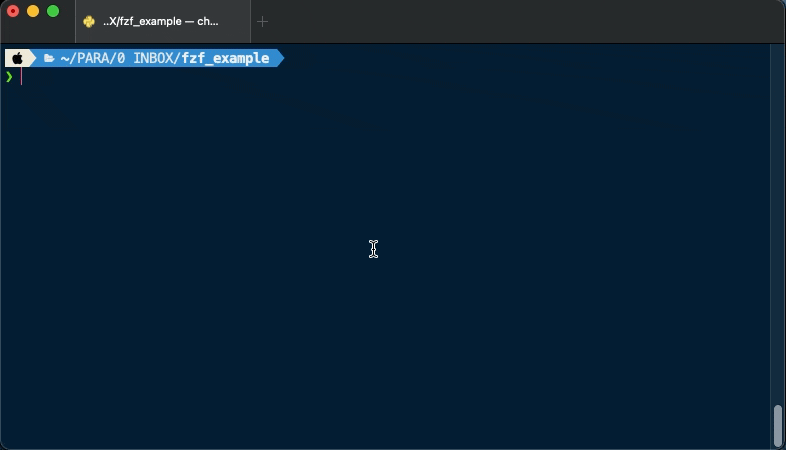
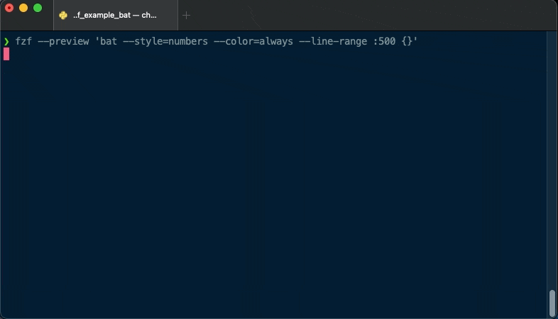

[Fuzzy search](https://en.wikipedia.org/wiki/Approximate_string_matching) is a great and easy way to find (back) stuff. You can use `fzf` on macOS and Linux to replace bash/zsh `bck-i-search`, make `find` obsolete and even get a quick way to preview files on the command line.

# Installing on macOS
We can install `fzf`using [brew](https://brew.sh/):

```shell
brew install fzf
```

# Enable integration
After installation (and a reload of our shell with `source ~/.zshrc`) we can use `fzf`as is or we can integrate it with our shell.

To "install" `fzf` in the shell run:

```shell
/usr/local/opt/fzf/install
```

Site note: When using `oh-my-zsh` you can enable `fzf` by adding it to you plug-in list. I had some bad experience with it so I'm doing it the manual way.

During install `fzf` will ask you if you want key-bindings. This will replace <kbd>CRTL + r</kbd> and <kbd>CTRL + R</kbd> for reverse search.

# Cool tricks
When invoking `fzf` in any directory it will act like `find . | fzf` . `fzf` will build a cache with underlining files. As an example I created 10 directory's with 10 files in them using:

```bash
$ mkdir fzf_dir_{1..10}
$ touch fzf_dir_{1..10}/file_{1..10}
```

When invoking `fzf`in this directory you can actively search all underlying folders and files:



# Using Preview

`fzf` even has a build in preview function. You can use it with `cat`or (even beter) with bat

- With `cat`: `fzf --preview 'cat {}'`
- With `bat`: `fzf --preview 'bat --style=numbers --color=always --line-range :500 {}'`

(tip: alias that last one to something like `fbat` or `pfzf`)


